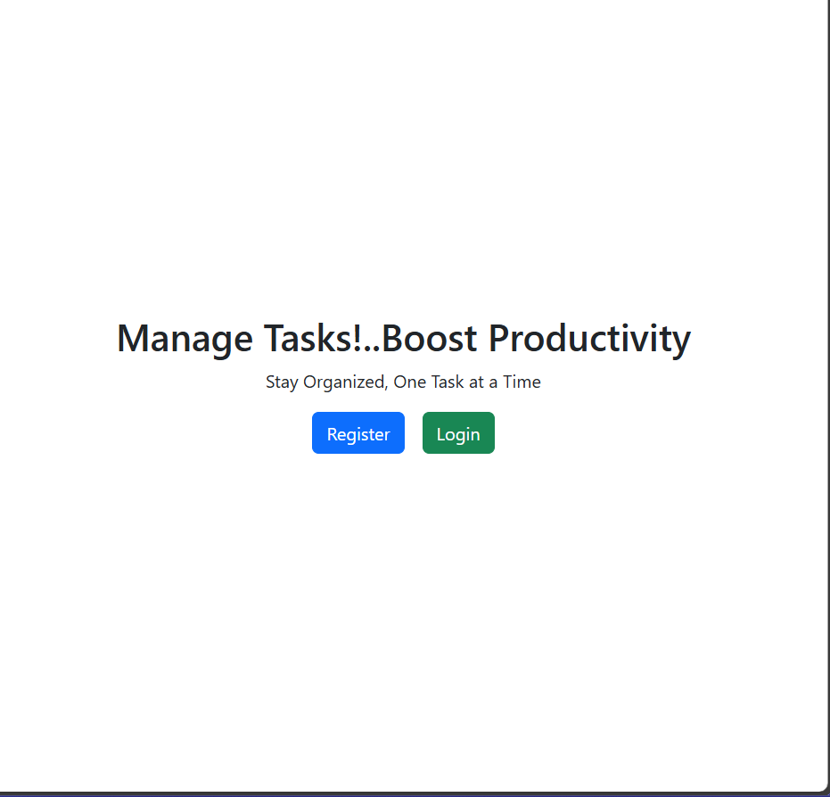
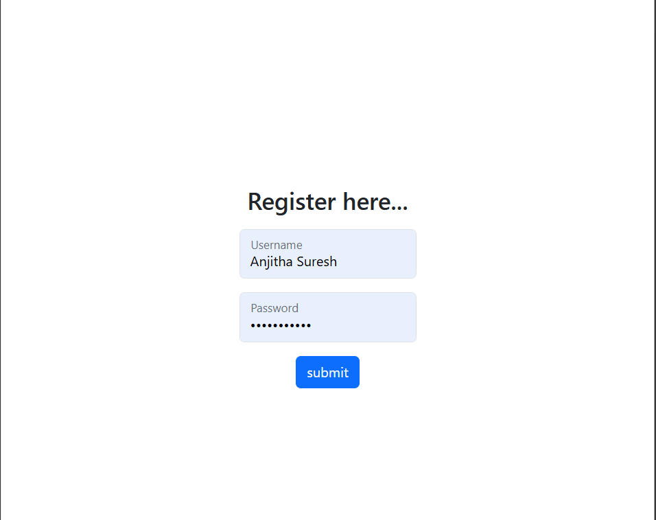
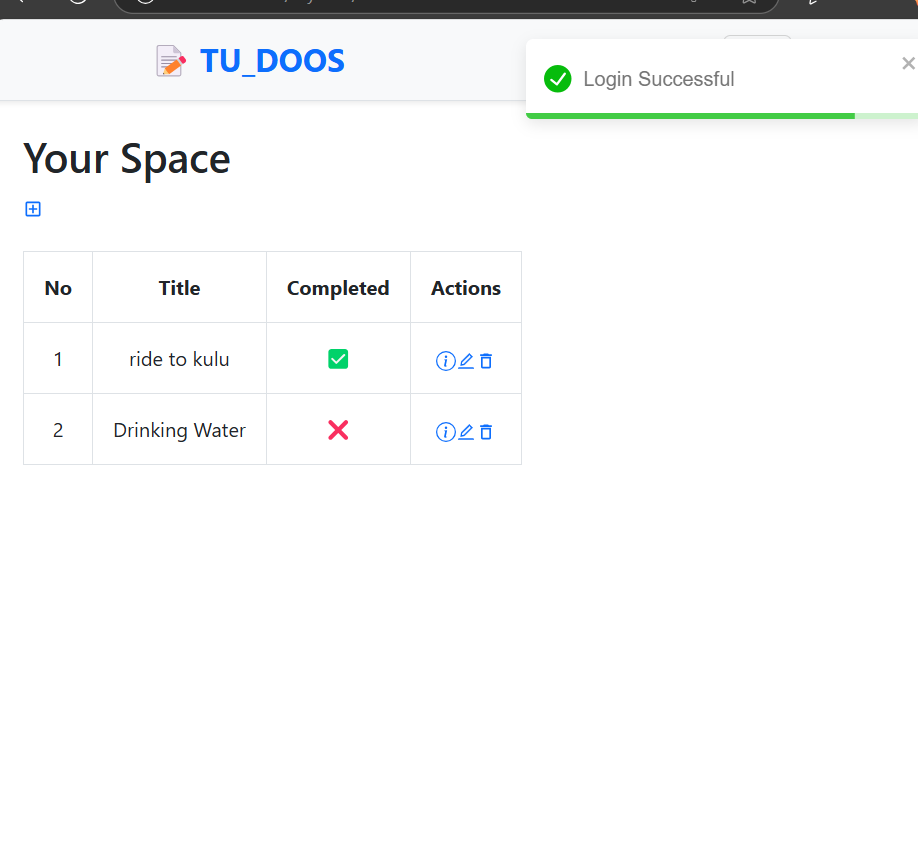
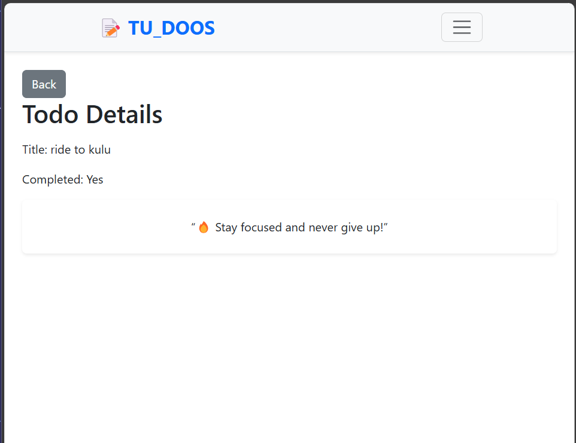

TU_DOOS is a simple and user-friendly To-Do List web application built using the MERN Stack (MongoDB, Express.js, React, and Node.js). Users can sign up, log in, create, edit, and delete their personal to-dos.

